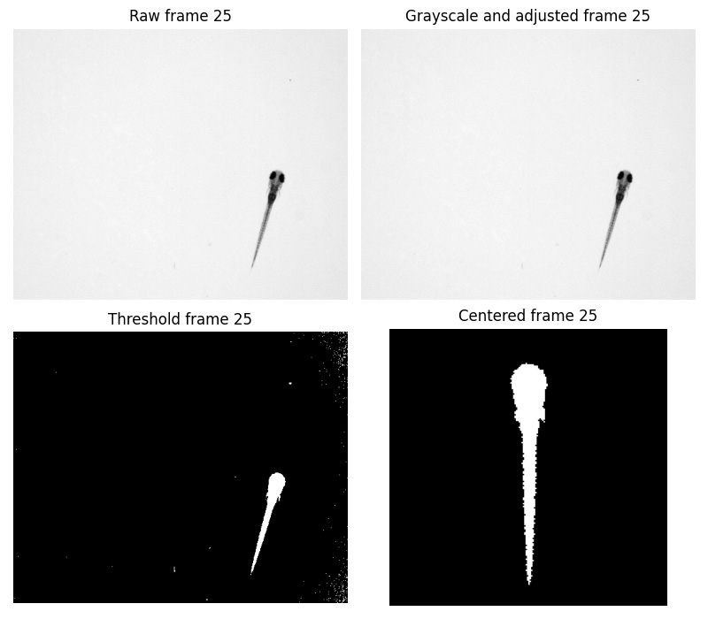
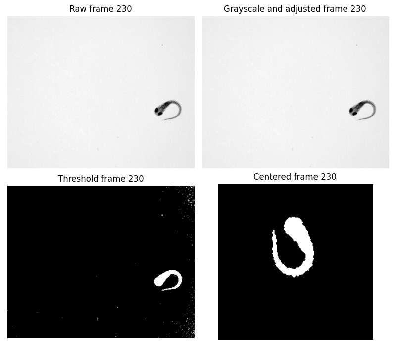

# Zebrafish Procrustes Analysis

This repository contains Python code for the segmentation of zebrafish larvae shapes as a pre-processing to the reconstruction of a 3D model of the larvae bending over time with translations and rotations subtracted, during an escape response triggered by an electrical stimuli.

## Project Structure

The main code is located in the `video_preprocessing/experiment.py` file. This file contains two classes: `Video` and `Frame`, which are used to process and analyze video frames.
Currently the processing is executed from the main.py in the project's root folder.

## Setup

To set up the project, follow these steps:

1. Clone the repository to your local machine.
2. Create a clean venv with python 3.10.x
3. Install the required Python packages using pip:
    ```
    pip install -r requirements.txt
    ```
4. Run the `main.py` script after adapting the path to source and target folders.

## Method

The main script of this project is `main.py`, which uses the `Video` and `Frame` classes from `video_preprocessing/experiment.py` to process and analyze video frames of zebrafish larvae.

The `Video` class is used to load and process video frames. It has methods to read frames from a video file and process these frames. The processing involves calculating the angles and mass centers of the zebrafish in each frame.

The `Frame` class represents an individual frame from the video. It contains methods to perform operations on the frame, such as identifying the zebrafish zone and adding to it based on the size of the dark object on a thresholded frame.

The `main.py` script initializes a `Video` object and reads frames from a video file. It then processes these frames to calculate the angles and mass centers of the zebrafish. The script also calculates the history of distances travelled by the mass center and surfaces of segmented fish, and saves these data to files. Finally, it uses a smoothing application to smooth the angles of rotation and processes the frames based on the smoothed angles (substraction of rotation and translation motions), before saving those to a non destructive format for further processing in other custom software.

## Example of processing
Example of two frames processed can be seen below:


